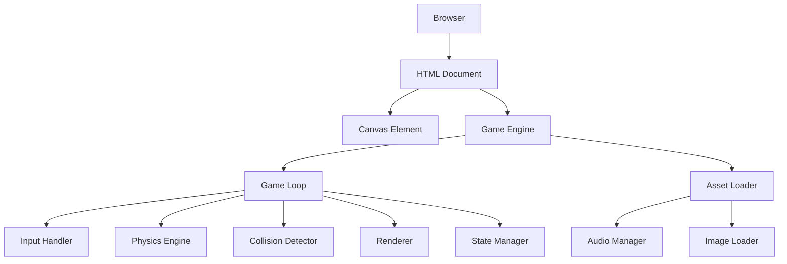
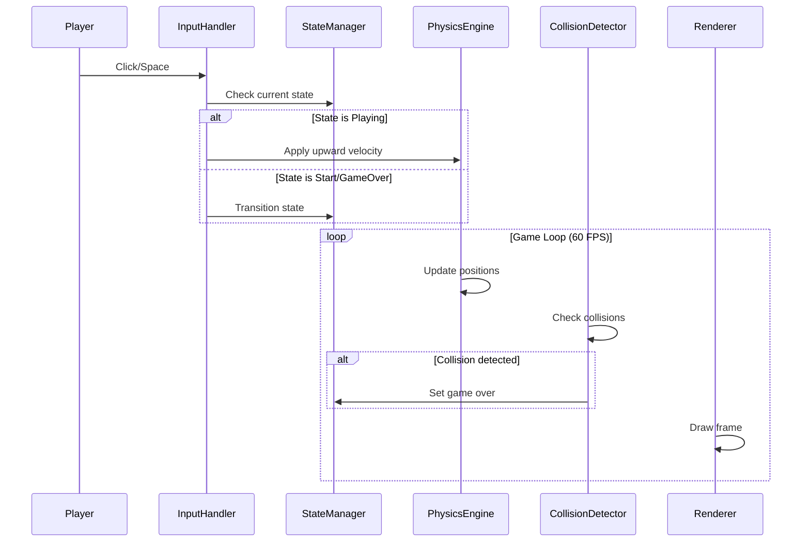

# Design Document: Flappy Kiro

## Overview

Flappy Kiro is a browser-based endless scrolling game implemented using vanilla JavaScript, HTML5 Canvas, and CSS. The game follows the classic "Flappy Bird" mechanic where a player-controlled character (Ghosty) must navigate through gaps in scrolling walls by applying upward velocity against constant gravity.

The architecture follows a game loop pattern with clear separation between game state management, physics simulation, rendering, and input handling. The game runs entirely client-side with no backend dependencies, making it portable and easy to deploy as a static web application.

### Key Design Principles

1. **Simplicity**: Pure JavaScript implementation without frameworks to minimize complexity and dependencies
2. **Separation of Concerns**: Clear boundaries between physics, rendering, collision detection, and state management
3. **Deterministic Physics**: Frame-rate independent physics simulation for consistent gameplay
4. **Progressive Enhancement**: Graceful degradation when assets fail to load

## Architecture

### High-Level Architecture



### Component Interaction Flow



### Module Structure

The game will be organized into the following modules:

- **main.js**: Entry point, initializes game and starts game loop
- **gameState.js**: Manages game state transitions (start, playing, game over)
- **physics.js**: Handles gravity, velocity, and position updates
- **collision.js**: Detects collisions between Ghosty and walls/boundaries
- **renderer.js**: Draws all visual elements to canvas
- **input.js**: Handles mouse and keyboard input
- **walls.js**: Manages wall generation, movement, and removal
- **assets.js**: Loads and manages sprites and audio files
- **audio.js**: Plays sound effects

## Components and Interfaces

### GameState Component

**Responsibility**: Manages the current state of the game and transitions between states.

**States**:
- `START`: Initial screen, waiting for player input
- `PLAYING`: Active gameplay
- `GAME_OVER`: Game ended, displaying final score

**Interface**:
```javascript
class GameState {
  constructor()
  getCurrentState(): string
  setState(newState: string): void
  reset(): void
  isPlaying(): boolean
  isGameOver(): boolean
  isStart(): boolean
}
```

### Physics Component

**Responsibility**: Simulates gravity-based movement and velocity calculations.

**Constants**:
- `GRAVITY`: 0.6 pixels/frame²
- `JUMP_VELOCITY`: -10 pixels/frame
- `MAX_FALL_VELOCITY`: 12 pixels/frame

**Interface**:
```javascript
class Physics {
  constructor(gravity, jumpVelocity, maxFallVelocity)
  applyGravity(entity): void
  applyJump(entity): void
  updatePosition(entity, deltaTime): void
  clampVelocity(entity): void
}
```

### Ghosty Component

**Responsibility**: Represents the player character with position, velocity, and dimensions.

**Interface**:
```javascript
class Ghosty {
  constructor(x, y, width, height)
  x: number
  y: number
  width: number
  height: number
  velocity: number
  sprite: Image
  reset(): void
  getBounds(): Rectangle
}
```

### Wall Component

**Responsibility**: Represents an obstacle with a gap that scrolls across the screen.

**Interface**:
```javascript
class Wall {
  constructor(x, gapY, gapHeight, width)
  x: number
  gapY: number
  gapHeight: number
  width: number
  speed: number
  passed: boolean
  update(): void
  isOffScreen(): boolean
  getBounds(): { top: Rectangle, bottom: Rectangle }
}
```

### WallManager Component

**Responsibility**: Generates, updates, and removes walls.

**Constants**:
- `WALL_SPAWN_INTERVAL`: 90 frames (~1.5 seconds at 60 FPS)
- `WALL_SPEED`: 3 pixels/frame
- `GAP_HEIGHT`: 150 pixels
- `WALL_WIDTH`: 60 pixels

**Interface**:
```javascript
class WallManager {
  constructor(canvasWidth, canvasHeight)
  walls: Wall[]
  framesSinceLastWall: number
  update(): void
  generateWall(): void
  removeOffScreenWalls(): void
  reset(): void
}
```

### CollisionDetector Component

**Responsibility**: Detects collisions between Ghosty and walls or screen boundaries.

**Interface**:
```javascript
class CollisionDetector {
  checkWallCollision(ghosty, wall): boolean
  checkBoundaryCollision(ghosty, canvasHeight): boolean
  rectanglesIntersect(rect1, rect2): boolean
}
```

### Renderer Component

**Responsibility**: Draws all game elements to the canvas.

**Interface**:
```javascript
class Renderer {
  constructor(canvas, context)
  clear(): void
  drawGhosty(ghosty): void
  drawWall(wall): void
  drawScore(score): void
  drawStartScreen(): void
  drawGameOverScreen(score): void
  render(gameState, ghosty, walls, score): void
}
```

### InputHandler Component

**Responsibility**: Captures and processes player input.

**Interface**:
```javascript
class InputHandler {
  constructor(canvas)
  onInput(callback): void
  enable(): void
  disable(): void
}
```

### AssetLoader Component

**Responsibility**: Loads images and audio files asynchronously.

**Interface**:
```javascript
class AssetLoader {
  constructor()
  loadImage(path): Promise<Image>
  loadAudio(path): Promise<Audio>
  loadAll(assetManifest): Promise<AssetMap>
}
```

### AudioManager Component

**Responsibility**: Plays sound effects with error handling.

**Interface**:
```javascript
class AudioManager {
  constructor(audioAssets)
  play(soundName): void
  setEnabled(enabled): void
}
```

### ScoreTracker Component

**Responsibility**: Tracks and updates the player's score.

**Interface**:
```javascript
class ScoreTracker {
  constructor()
  score: number
  reset(): void
  increment(): void
  getScore(): number
}
```

## Data Models

### Ghosty Entity

```javascript
{
  x: number,              // X position (pixels)
  y: number,              // Y position (pixels)
  width: number,          // Width (pixels)
  height: number,         // Height (pixels)
  velocity: number,       // Vertical velocity (pixels/frame)
  sprite: Image | null    // Loaded sprite or null
}
```

### Wall Entity

```javascript
{
  x: number,              // X position (pixels)
  gapY: number,           // Y position of gap center (pixels)
  gapHeight: number,      // Height of gap (pixels)
  width: number,          // Width of wall (pixels)
  speed: number,          // Horizontal scroll speed (pixels/frame)
  passed: boolean         // Whether Ghosty has passed this wall
}
```

### Rectangle (for collision detection)

```javascript
{
  x: number,              // Top-left X
  y: number,              // Top-left Y
  width: number,          // Width
  height: number          // Height
}
```

### Game Configuration

```javascript
{
  canvas: {
    width: 480,
    height: 640
  },
  physics: {
    gravity: 0.6,
    jumpVelocity: -10,
    maxFallVelocity: 12
  },
  ghosty: {
    startX: 100,
    startY: 320,
    width: 40,
    height: 40
  },
  walls: {
    width: 60,
    gapHeight: 150,
    speed: 3,
    spawnInterval: 90
  },
  assets: {
    ghostySprite: 'assets/ghosty.png',
    jumpSound: 'assets/jump.wav',
    gameOverSound: 'assets/game_over.wav'
  }
}
```

### Asset Manifest

```javascript
{
  images: {
    ghosty: 'assets/ghosty.png'
  },
  audio: {
    jump: 'assets/jump.wav',
    gameOver: 'assets/game_over.wav'
  }
}
```


## Error Handling

### Asset Loading Failures

**Strategy**: Graceful degradation with fallback rendering

**Implementation**:
1. **Image Loading Failure**:
   - If `ghosty.png` fails to load, render Ghosty as a colored rectangle (fallback shape)
   - Log warning to console but continue game initialization
   - Set `ghosty.sprite = null` to trigger fallback rendering path

2. **Audio Loading Failure**:
   - If audio files fail to load, disable audio playback
   - Game continues without sound effects
   - Log warning to console
   - `AudioManager.play()` becomes a no-op

**Error Detection**:
```javascript
// Image loading with fallback
assetLoader.loadImage('assets/ghosty.png')
  .catch(err => {
    console.warn('Failed to load ghosty sprite:', err);
    return null; // Triggers fallback rendering
  });

// Audio loading with fallback
assetLoader.loadAudio('assets/jump.wav')
  .catch(err => {
    console.warn('Failed to load jump sound:', err);
    return null; // Disables audio
  });
```

### Canvas Context Failures

**Strategy**: Fail fast with user-visible error message

**Implementation**:
- If `canvas.getContext('2d')` returns null, display error message in DOM
- Prevent game initialization
- Show message: "Your browser does not support HTML5 Canvas. Please use a modern browser."

**Error Detection**:
```javascript
const context = canvas.getContext('2d');
if (!context) {
  document.body.innerHTML = '<div class="error">Canvas not supported</div>';
  return;
}
```

### Frame Rate Variations

**Strategy**: Delta-time based physics to maintain consistent gameplay

**Implementation**:
- Calculate time delta between frames
- Scale physics updates by delta time
- Cap maximum delta to prevent large jumps (e.g., when tab loses focus)

**Error Detection**:
```javascript
const deltaTime = Math.min((currentTime - lastTime) / 16.67, 2.0);
// Clamp to max 2x normal speed to prevent physics breaking
```

### Invalid Game State Transitions

**Strategy**: Defensive state validation

**Implementation**:
- Validate state transitions in `GameState.setState()`
- Log warnings for invalid transitions
- Ignore invalid transition requests

**Valid Transitions**:
- `START` → `PLAYING`
- `PLAYING` → `GAME_OVER`
- `GAME_OVER` → `START`

**Error Detection**:
```javascript
setState(newState) {
  const validTransitions = {
    START: ['PLAYING'],
    PLAYING: ['GAME_OVER'],
    GAME_OVER: ['START']
  };
  
  if (!validTransitions[this.currentState].includes(newState)) {
    console.warn(`Invalid transition: ${this.currentState} -> ${newState}`);
    return;
  }
  
  this.currentState = newState;
}
```

### Collision Detection Edge Cases

**Strategy**: Boundary validation and safe defaults

**Implementation**:
- Validate that Ghosty and Wall objects have valid bounds before collision checks
- Return `false` (no collision) if bounds are invalid
- Prevent crashes from malformed entities

**Error Detection**:
```javascript
checkWallCollision(ghosty, wall) {
  if (!ghosty || !wall) return false;
  if (!ghosty.getBounds || !wall.getBounds) return false;
  
  // Proceed with collision check
}
```

### Memory Leaks

**Strategy**: Proper cleanup of event listeners and removed entities

**Implementation**:
1. **Event Listeners**: Remove listeners when game is destroyed
2. **Wall Cleanup**: Remove walls from array when off-screen
3. **Audio Cleanup**: Pause and reset audio elements when not in use

**Prevention**:
```javascript
// Clean up event listeners
destroy() {
  this.inputHandler.disable();
  this.audioManager.cleanup();
}

// Remove off-screen walls
removeOffScreenWalls() {
  this.walls = this.walls.filter(wall => !wall.isOffScreen());
}
```

## Testing Strategy

### Overview

Flappy Kiro is a browser-based game with heavy UI rendering, canvas drawing, and event-driven gameplay. **Property-based testing is not appropriate** for this feature because:

1. **UI Rendering**: The core functionality involves drawing to canvas and visual presentation
2. **Side Effects**: Most operations are side-effect heavy (canvas drawing, audio playback, DOM events)
3. **Event-Driven**: Gameplay is driven by user input events and animation frames
4. **Stateful Animation**: Game state is tightly coupled to the rendering loop

Instead, the testing strategy focuses on:
- **Unit tests** for pure logic functions (collision detection, physics calculations, state transitions)
- **Integration tests** for game loop behavior and component interaction
- **Manual testing** for visual rendering, audio feedback, and gameplay feel

### Unit Testing

**Target**: Pure functions and isolated logic

**Test Cases**:

1. **Collision Detection** (`collision.js`)
   - Test `rectanglesIntersect()` with overlapping rectangles
   - Test `rectanglesIntersect()` with non-overlapping rectangles
   - Test `rectanglesIntersect()` with edge-touching rectangles
   - Test `checkBoundaryCollision()` with Ghosty above screen
   - Test `checkBoundaryCollision()` with Ghosty below screen
   - Test `checkBoundaryCollision()` with Ghosty within bounds

2. **Physics Calculations** (`physics.js`)
   - Test `applyGravity()` increases velocity correctly
   - Test `applyJump()` sets velocity to jump velocity
   - Test `clampVelocity()` limits velocity to max fall speed
   - Test `updatePosition()` updates position based on velocity
   - Test velocity clamping with extreme values

3. **State Management** (`gameState.js`)
   - Test valid state transitions (START → PLAYING → GAME_OVER → START)
   - Test invalid state transitions are rejected
   - Test `reset()` returns to START state
   - Test state query methods (`isPlaying()`, `isGameOver()`, `isStart()`)

4. **Score Tracking** (`scoreTracker.js`)
   - Test `reset()` sets score to zero
   - Test `increment()` increases score by one
   - Test multiple increments accumulate correctly

5. **Wall Management** (`walls.js`)
   - Test `isOffScreen()` returns true when wall.x < -wall.width
   - Test `isOffScreen()` returns false when wall is visible
   - Test wall generation creates wall with random gap position
   - Test gap position is within valid bounds (not too high or low)

**Testing Framework**: Jest or Vitest (lightweight, fast, good for vanilla JS)

**Example Test**:
```javascript
describe('CollisionDetector', () => {
  test('detects collision when rectangles overlap', () => {
    const rect1 = { x: 0, y: 0, width: 10, height: 10 };
    const rect2 = { x: 5, y: 5, width: 10, height: 10 };
    expect(rectanglesIntersect(rect1, rect2)).toBe(true);
  });
  
  test('no collision when rectangles do not overlap', () => {
    const rect1 = { x: 0, y: 0, width: 10, height: 10 };
    const rect2 = { x: 20, y: 20, width: 10, height: 10 };
    expect(rectanglesIntersect(rect1, rect2)).toBe(false);
  });
});
```

### Integration Testing

**Target**: Component interaction and game loop behavior

**Test Cases**:

1. **Game Initialization**
   - Test game initializes with START state
   - Test canvas context is created
   - Test Ghosty is positioned correctly
   - Test score is initialized to zero

2. **Input Handling**
   - Test click during START state transitions to PLAYING
   - Test space key during START state transitions to PLAYING
   - Test input during PLAYING applies jump velocity
   - Test input during GAME_OVER transitions to START

3. **Game Loop Integration**
   - Test walls spawn at regular intervals during PLAYING state
   - Test walls do not spawn during START or GAME_OVER states
   - Test Ghosty position updates each frame during PLAYING
   - Test collision triggers GAME_OVER state
   - Test score increments when Ghosty passes wall

4. **Asset Loading**
   - Test game waits for assets before allowing gameplay
   - Test game continues with fallback rendering if sprite fails
   - Test game continues without audio if sounds fail

**Testing Approach**: Use jsdom or Playwright for browser environment simulation

**Example Integration Test**:
```javascript
describe('Game Loop', () => {
  test('collision triggers game over', () => {
    const game = new Game(mockCanvas);
    game.start();
    
    // Position Ghosty to collide with wall
    game.ghosty.y = 0; // Top of screen
    game.update();
    
    expect(game.state.isGameOver()).toBe(true);
  });
});
```

### Manual Testing

**Target**: Visual rendering, audio feedback, gameplay feel

**Test Scenarios**:

1. **Visual Rendering**
   - Verify Ghosty sprite renders correctly
   - Verify walls render with visible gaps
   - Verify score displays in retro font
   - Verify start screen shows title and instructions
   - Verify game over screen shows final score
   - Test on different screen sizes

2. **Audio Feedback**
   - Verify jump sound plays on input
   - Verify game over sound plays on collision
   - Verify audio gracefully fails if files missing

3. **Gameplay Feel**
   - Verify gravity feels natural
   - Verify jump height is appropriate
   - Verify wall speed provides good challenge
   - Verify gap size is passable but challenging
   - Verify collision detection feels fair (not too strict or loose)

4. **Browser Compatibility**
   - Test on Chrome, Firefox, Safari, Edge
   - Test on different screen resolutions
   - Test with audio enabled/disabled

**Testing Checklist**:
- [ ] Game loads without errors
- [ ] Start screen displays correctly
- [ ] Click/Space starts game
- [ ] Ghosty responds to input
- [ ] Walls scroll smoothly
- [ ] Collision detection works accurately
- [ ] Score increments correctly
- [ ] Game over screen displays
- [ ] Restart works correctly
- [ ] Audio plays (if available)
- [ ] Fallback rendering works if assets fail

### Test Coverage Goals

- **Unit Tests**: 80%+ coverage of pure logic functions
- **Integration Tests**: Cover all major game loop paths and state transitions
- **Manual Tests**: Complete checklist before each release

### Continuous Testing

**Development Workflow**:
1. Run unit tests on every code change (watch mode)
2. Run integration tests before commits
3. Perform manual testing for visual/audio changes
4. Test on multiple browsers before release

**Automated Testing**:
- Set up CI pipeline to run unit and integration tests
- Use Playwright for automated browser testing
- Generate coverage reports

## Implementation Notes

### Game Loop Structure

The game will use `requestAnimationFrame` for smooth 60 FPS rendering:

```javascript
function gameLoop(currentTime) {
  const deltaTime = (currentTime - lastTime) / 16.67;
  lastTime = currentTime;
  
  if (gameState.isPlaying()) {
    physics.update(ghosty, deltaTime);
    wallManager.update();
    
    // Check collisions
    if (collisionDetector.checkBoundaryCollision(ghosty, canvas.height) ||
        wallManager.walls.some(wall => collisionDetector.checkWallCollision(ghosty, wall))) {
      gameState.setState('GAME_OVER');
      audioManager.play('gameOver');
    }
    
    // Check score
    wallManager.walls.forEach(wall => {
      if (!wall.passed && wall.x + wall.width < ghosty.x) {
        wall.passed = true;
        scoreTracker.increment();
      }
    });
  }
  
  renderer.render(gameState, ghosty, wallManager.walls, scoreTracker.getScore());
  requestAnimationFrame(gameLoop);
}
```

### Performance Considerations

1. **Object Pooling**: Consider reusing wall objects instead of creating/destroying
2. **Canvas Optimization**: Clear only dirty regions if performance issues arise
3. **Asset Preloading**: Load all assets before starting game loop
4. **Event Throttling**: Debounce input events if needed (unlikely for this simple game)

### Accessibility Considerations

While this is a visual game, some basic accessibility can be provided:
- Keyboard controls (Space) in addition to mouse
- High contrast visuals
- Clear visual feedback for game states
- Consider adding sound toggle for users who prefer silent gameplay

### Future Enhancements

Potential features for future iterations:
- High score persistence (localStorage)
- Difficulty progression (increasing speed)
- Multiple character skins
- Background music toggle
- Mobile touch controls
- Leaderboard (requires backend)

